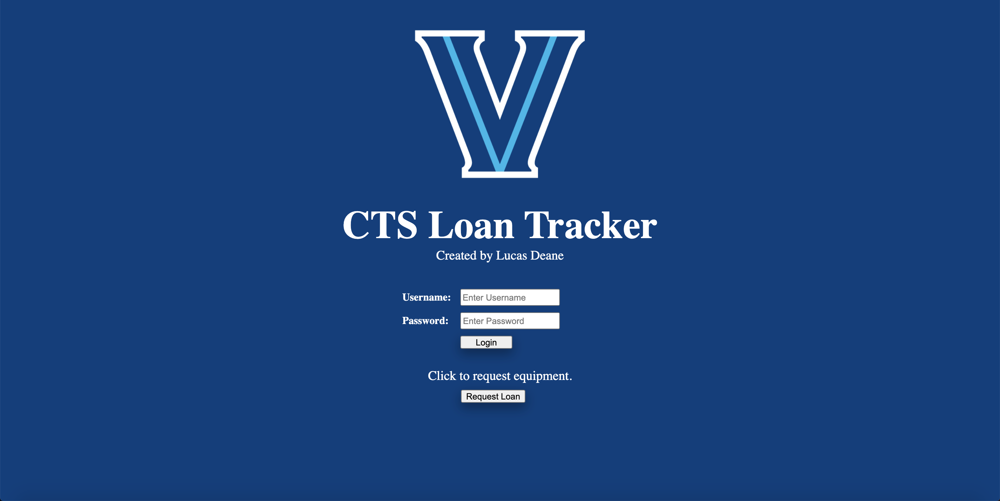
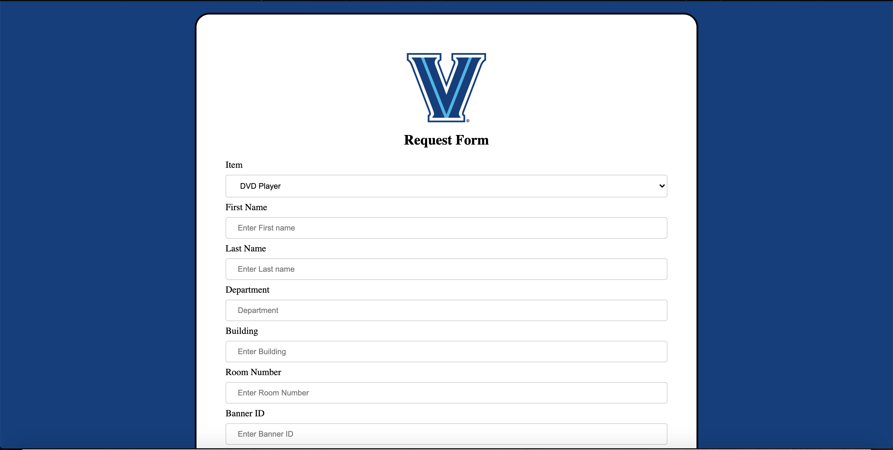
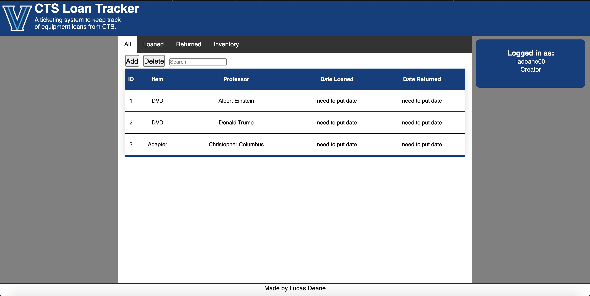
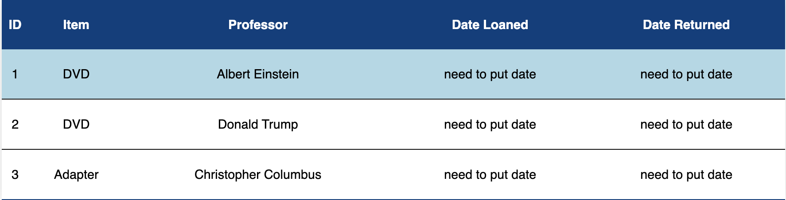
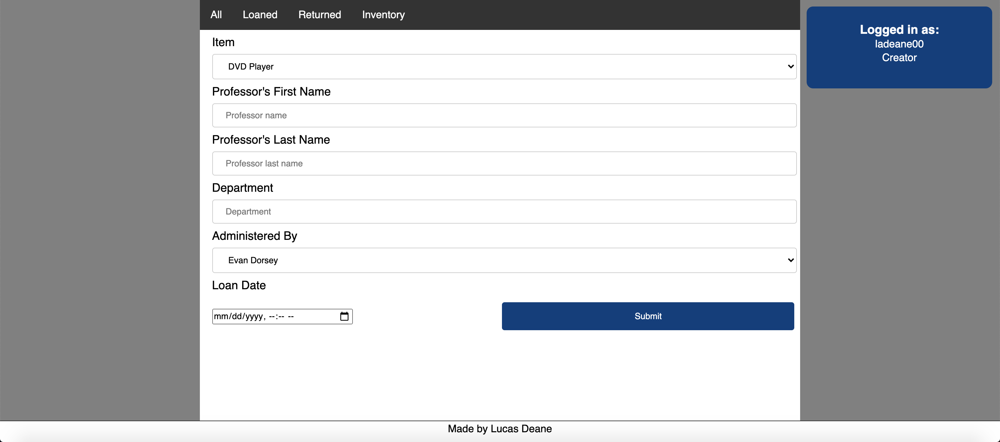

This application will offer two points of view: one for professors requesting classroom equipment loans and one for classroom support members to facilitate the transaction. It utilizes user authentication on the classroom support side with varying permissions. It communicates with a database of all inventory, loaned, and returned items. If an item has been loaned out past the date of expected return, it will send an email to the professor to remind them to return it. It utiizes HTML/CSS, Javascript, and PHP to faciliate connections with the database with SQL. In terms of security, it utilizes PHP filter extensions to prevent user input from having harmful characters through either recommending the user to not use them or entirely sanitizing it before database entry. It also uses PHP hashing in order to have password hashes stored in the database instead of the physical password to completely prevent sensitive data exposure.    

**In Progress**   

**GitHub Link:**
 <a href="https://github.com/ladeane00/CTSLoanTracker">Here</a>

 -------------------------------------------------------------------------------------------|
- | 

-------------------------------------------------------------------------------------------|
- | 

-------------------------------------------------------------------------------------------|
- | 

-------------------------------------------------------------------------------------------|
- | 

-------------------------------------------------------------------------------------------|
- | 
