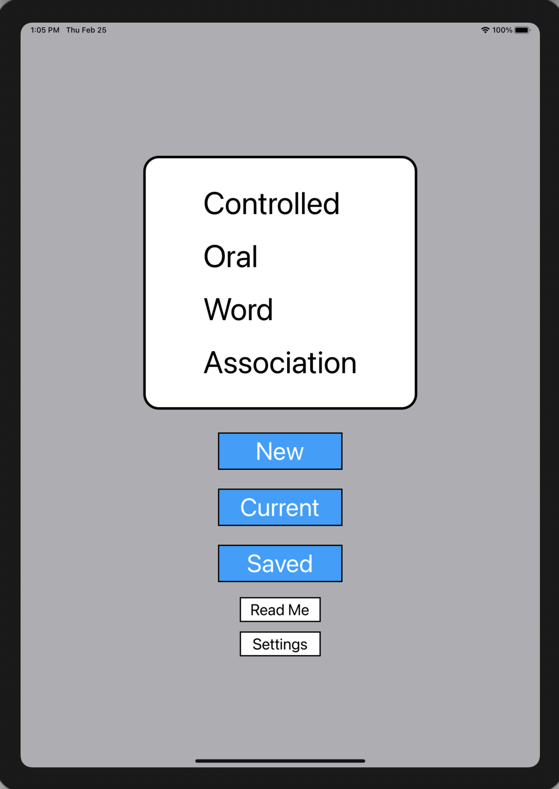
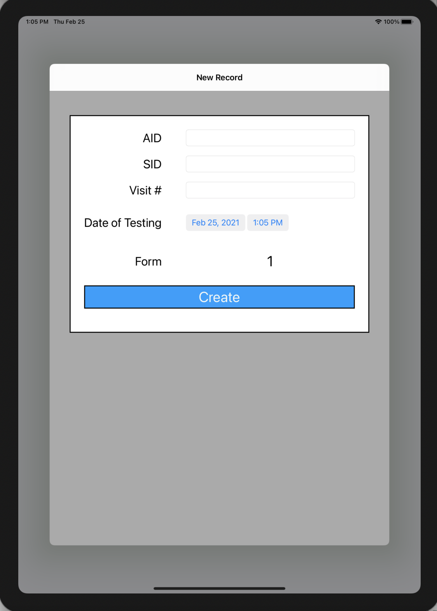
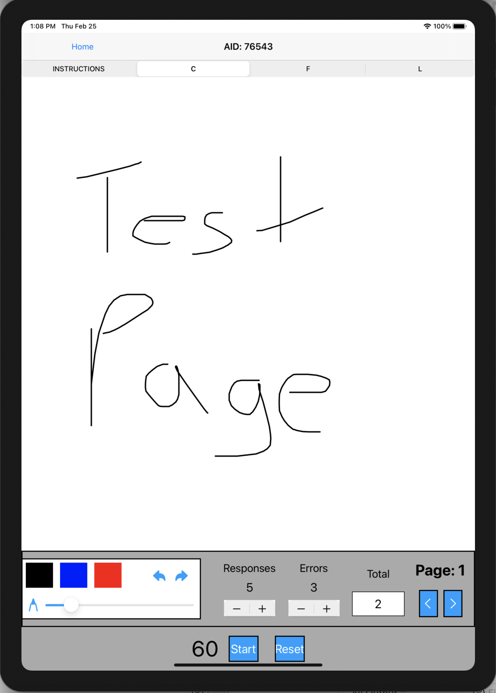
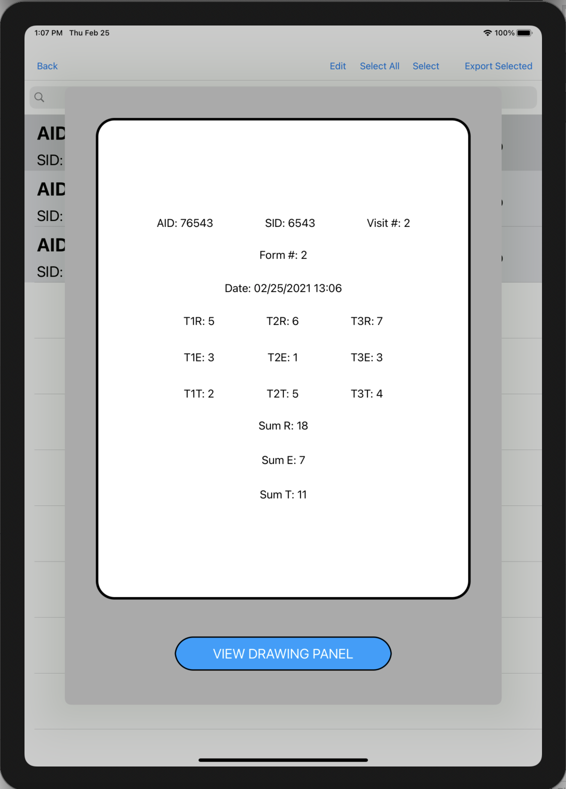
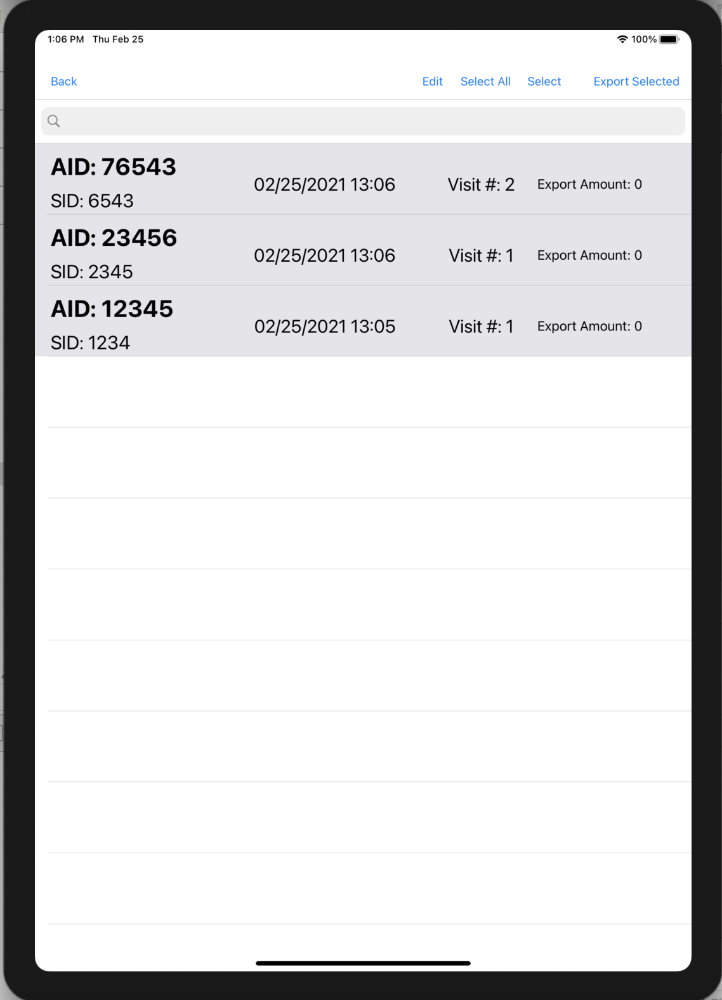
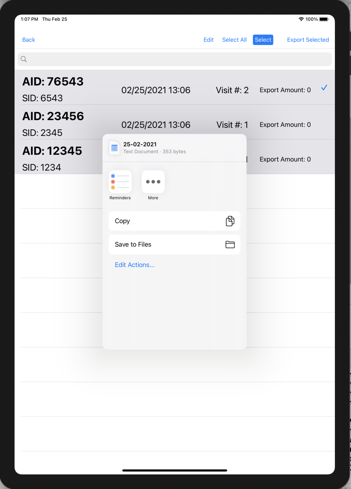
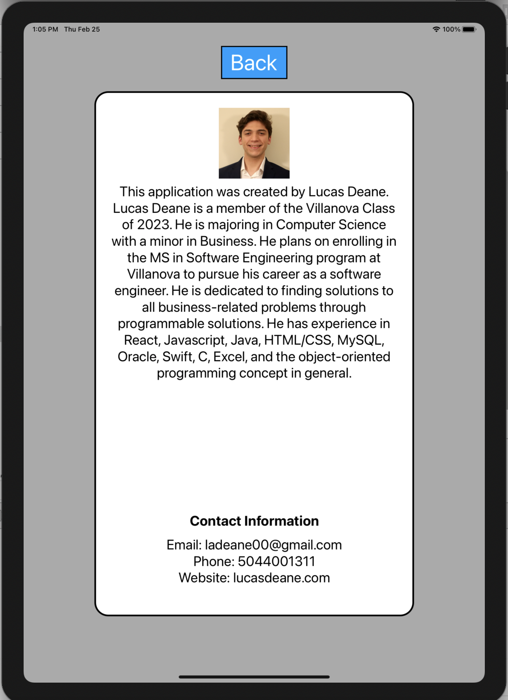
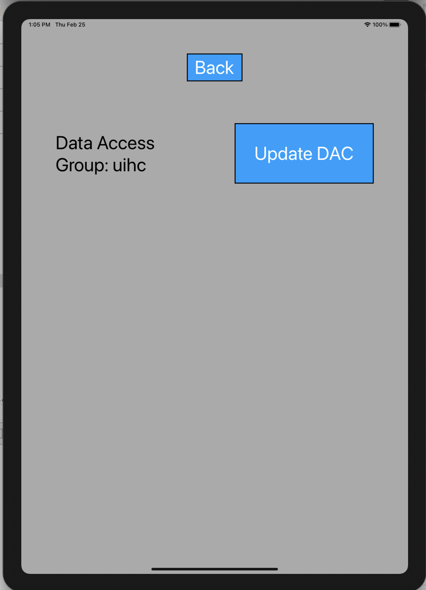

This project is being created to aid a national neural research project by presenting a digital iPad application assessment to be used by the researchers to gain data from participants. The test consists of naming as many words as possible that start with a specific letter within one minute. This process is repeated a few times and recorded into this iPad application interface I created. The researchers can then save the record to the iPad file system. 

**PRIVACY POLICY**   
This application does not collect personal data or use any user tracking or analytics solutions.

**GitHub Link:**
 <a href="https://github.com/ladeane00/COWA">Here</a> 

------------------------------------------------|  ------------------------------------------------ 
- | - |
 | 

------------------------------------------------|------------------------------------------------ 
- | - |
 | 

------------------------------------------------|  ------------------------------------------------ 
- | - |
 | 

------------------------------------------------|------------------------------------------------ 
- | - |
 |  